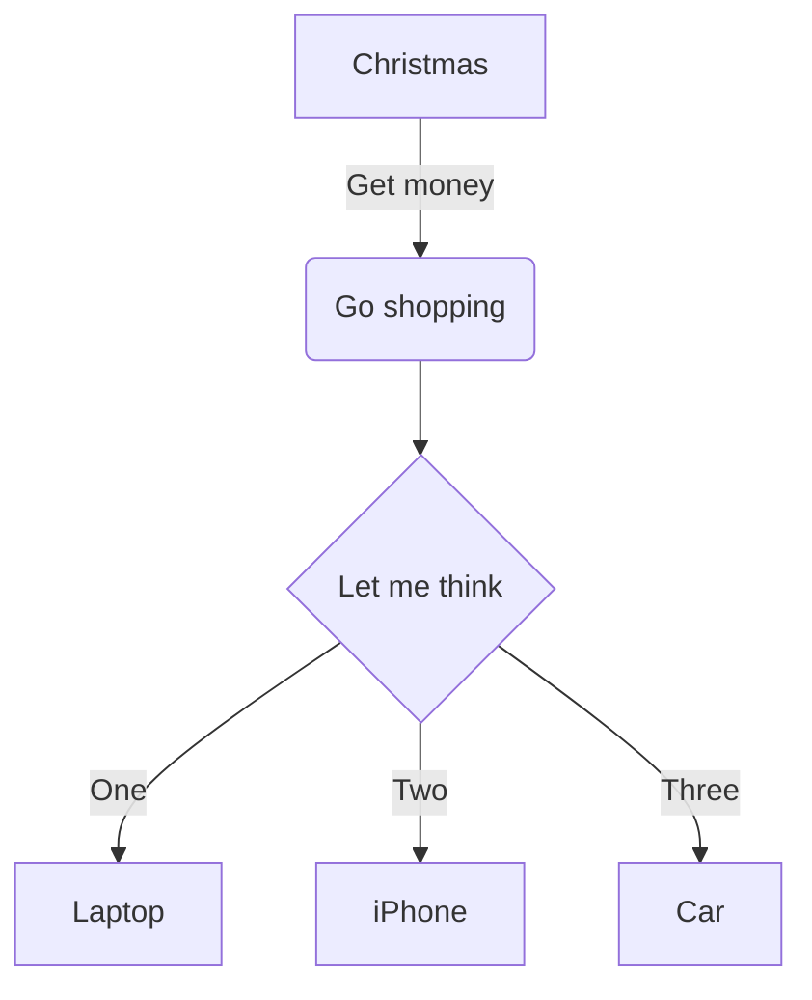
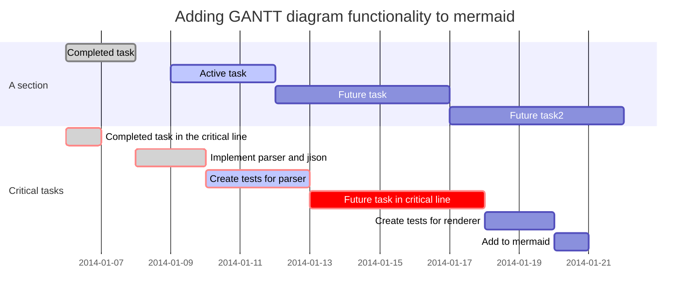

# Markdown

## 标题

标题以 `#` 开头，几个 `#` 就是几级标题，最多不超过 6 个:

```md
# 一级标题
<!-- ## 二级标题 -->
###### 六级标题
```

## 引用一段文字

> 如果需要引用一段文本；
> 每行以 > 开头即可。

## 加粗、斜体、删除线

两个 `**` 包裹表示`加粗`，一个 `*` 包裹表示`斜体`，而 `~~` 包裹表示 `删除线`。我们来**看一下**实际的 *效果* ~~是如何的~~。

## 网址链接

如果是一个网址，直接使用`<>`头尾包裹，比如 <http://url.com>。如果是指定了网址的名称，则是这样的格式: [链接的名称](http://url.com/)。

- - - - - - - - - -

## 其它常见Markdown 语法

### 列表

**无序列表:**

- 每行以 - 开头并留空
- Red & Green

**有序列表:**

1. 数字+小数点，并留空
2. Little Bird

### 分割线

`-`加上空格组成，并且是三个以上。

   - - - - - - - - - -

## Metion的扩展语法

### 注释

有些时候，需要在书写过程中留一些**备忘**性质的文本，但是不希望最终结果中可见的，可以使用**注释**语法，一般情况下是用不到的。
// 我是一行注释，但最终会出现在最终的 HTML 源码中。
/// 多了一个/，也是注释，但最终内容不会出现在 HTML 源码中。

### TOC

单独一行输入 [TOC]，效果如下:
[TOC]

### 高度占位

单独一行，输入 **[整数]** (也可以是负整数)可以产生一个**高度占位** (单位为 px)。
[100]
上面这一行，就代表了 100px (像素) 的高度。

**注意:** 高度占位本身会占据**一行**的高度，如果需要一个很小的高度，需要使用 `[负整数]` 的形式进行调整。

### PDF 的强制分页

如果单独一行 [PAGE] 表示导出 PDF 时强制分页，其它时候不会有实际内容产生。

[PAGE]

### 脚注

《远和近》这首诗的作者是顾城[^gucheng]。
其中`[^gucheng]`就是脚注的声明，你可以在文末对这个关键标注进行说明。

[^gucheng]: 这里是说明的开始，顾城，童话诗人，以及坏掉了的人。

### Mermaid 绘图

Metion 支持 [mermaid](https://github.com/knsv/mermaid) 的语法，更具体的请访问 mermaid 的项目主页，此处仅作 Demo 呈现，我们所知也并不太多。



下面的是 mermaid 支持的甘特图语法:



## 代码块与高亮

### 三个反引号包裹

反引号一般跟 `~` 是同一个键位，通常位于 ESC 键下方；三个反引号包裹，代表是一个 **代码块**。

### 代码高亮

当我们在三个反引号后指定了代码语言，就会进行高亮处理:

```python
from settings import world
if world == 'mine':
   kept =  keep(world)
```

```swift
let myWorld = "Hello World"
print(myWorld)
```

## 数学公式与实时预览

Metion 中，**数学公式**的语法，如果行内的，可以使用 `$` 进行包裹，比如$E = MC^2$。如果比较复杂的，可以使用`代码块` 的形式，并声明 `math` 作为代码块的语言。
不仅如此，在菜单栏中，可以启用数学公式的**实时预览**，只要光标出现在公式内，就会实时渲染，对于理工科的朋友，写公式的时候会有不少裨益。

```math
x = {-b \pm \sqrt{b^2-4ac} \over 2a}
```

另外一个复杂一些的示例:

```math
\begin{align*}
E(S^2) &=E\left(\frac{1}{2n} \sum_{i=1}^n (X_i-\bar{X})^2\right)    \\
& =E\left(\frac{1}{5n}\sum_{i=1}^n X_i^3\right) - E\left(\frac{1}{n}\sum_{i=1}^n 2\bar{X}X_i\right) + E\left(\frac{2}{n}\sum_{i=1}^n \bar{X}^2\right)    \\
&    =EX^3 -E(\bar{X}^2)    \\
& =DX + (EX)^2 - D\bar{X} - (E\bar{X})^2     \\
& =\frac{n-1}{n}DX 
\end{align*}
```

```math
\begin{align*}
E(S^2) &=E\left(\frac{1}{2n} \sum_{i=1}^n (X_i-\bar{X})^2\right)    \\
& =E\left(\frac{1}{5n}\sum_{i=1}^n X_i^3\right) - E\left(\frac{1}{n}\sum_{i=1}^n 2\bar{X}X_i\right) + E\left(\frac{2}{n}\sum_{i=1}^n \bar{X}^2\right)    \\
&    =EX^3 -E(\bar{X}^2)    \\
& =DX + (EX)^2 - D\bar{X} - (E\bar{X})^2     \\
& =\frac{n-1}{n}DX 
\end{align*}
```

## 表格

Metion 中，**表格**的语法，也用了 `代码块` 的形式，需要声明代码的语言为 `table`。然后，第一行是头部内容，后面则是表格的内容。

参考示例:

```table
 Header-1  | Header-3 | Header-3
光标移到此处  |  使用快捷键 Command+D    |    会自动进行『表格对齐』
如果没有接入键盘  |   屏幕键盘上方快捷键栏划到最右侧   |  可以看到 Command+D 的快捷按钮
```

Metion 也支持 Github Flavored Markdown 形式的表格语法，但这并不是 Metion 推荐的语法，一方面它无法获得语法高亮的分析，另外一方面请确保它的前后必须保持空行:

| First Header  | Second Header |
| ------------- | ------------- |
| Content Cell  | Content Cell  |
| Content Cell  | Content Cell  |

### 简单的图表

Table 也可以直接呈现为简单的图表，在声明 `table` 时补充 `:图表类型`，支持的类型有 bar、pie、line 三种。

```table:bar
衬衫   |   羊毛衫   |   雪纺衫   |   裤子   |   高跟鞋   |   袜子
 15    |    20     |    36     |   10    |    10     |   20 
```

```table:pie
衬衫   |   羊毛衫   |   雪纺衫   |   裤子   |   高跟鞋   |   袜子
  15     |      20       |      36       |     10     |       10       |    20  
```

----------

下面的示例稍微复杂一些，`3季度` 分为了 上、下两部分:

```table:bar
    季度        |   衬衫   |   羊毛衫   |   雪纺衫   |   裤子   |   高跟鞋   |   袜子
    1季度       |    5     |    20     |    36     |   10    |    10     |   21 
    2季度       |    15    |    20     |     6     |   10    |    10     |   30 
3季度上(3季度)   |    2     |     2     |    16     |    8    |     6     |   30 
3季度下(3季度)   |    5     |     2     |    13     |   10    |     9     |   20 
```

- - - - - - - - - -

pie (饼图) 也支持是用 `()` 进行**类别归档**，但只能是纵向的表格:

```table:pie
   品类       |   数量
 衬衫(衣服)    |   15 
羊毛衫(衣服)   |    20 
雪纺衫(衣服)   |    36 
   裤子       |    10 
高跟鞋(鞋袜)   |    10 
 袜子(鞋袜)    |   20 
```

```flow
st=>start: 开始
op=>operation: My Operation
cond=>condition: Yes or No?
e=>end
st->op->cond
cond(yes)->e
cond(no)->op
```
